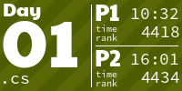
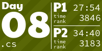
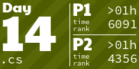
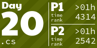
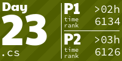
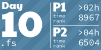
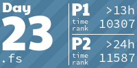
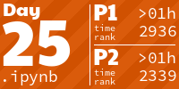
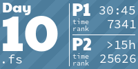
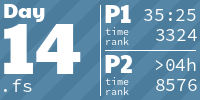

# Advent of Code

Here are my solutions for the [Advent of Code event](https://adventofcode.com/).

## :two::zero::two::four:

I had been missing various features of C#. At the same time, I was wondering how well I could handle situations where I had previously relied heavily on specific features of F#. So, this year, I decided to solve the AoC puzzles in C#. And I would catch myself willing to have type aliases / tail recursion / structural equality / whatever, but generally speaking, it was a more comfortable experience, especially since I did not have to push myself to avoid using an imperative style.

Additionally, I was looking forward to improving the parsing process. I tried out [Superpower](https://github.com/datalust/superpower) and managed to achieve a concise syntax for some common patterns found in AoC inputs like lines and blocks. It worked fairly well, though dealing with its backtracking was tricky. I also succeeded to construct a parser from a template with use of custom interpolated string handlers, like the following: 
```csharp
Template.Matching<int, int>($"p={Numerics.IntegerInt32},{Numerics.IntegerInt32};") // TextParser<(int, int)>
```

<a href="src/aoc/Year2024/Day01.cs"></a>
<a href="src/aoc/Year2024/Day02.cs"></a>
<a href="src/aoc/Year2024/Day03.cs"></a>
<a href="src/aoc/Year2024/Day04.cs"></a>
<a href="src/aoc/Year2024/Day05.cs"></a>
<a href="src/aoc/Year2024/Day06.cs"></a>
<a href="src/aoc/Year2024/Day07.cs"></a>
<a href="src/aoc/Year2024/Day08.cs"></a>
<a href="src/aoc/Year2024/Day09.cs"></a>
<a href="src/aoc/Year2024/Day10.cs"></a>
<a href="src/aoc/Year2024/Day11.cs"></a>
<a href="src/aoc/Year2024/Day12.cs"></a>
<a href="src/aoc/Year2024/Day13.cs"></a>
<a href="src/aoc/Year2024/Day14.cs"></a>
<a href="src/aoc/Year2024/Day15.cs"></a>
<a href="src/aoc/Year2024/Day16.cs"></a>
<a href="src/aoc/Year2024/Day17.cs"></a>
<a href="src/aoc/Year2024/Day18.cs"></a>
<a href="src/aoc/Year2024/Day19.cs"></a>
<a href="src/aoc/Year2024/Day20.cs"></a>
<a href="src/aoc/Year2024/Day21.cs"></a>
<a href="src/aoc/Year2024/Day22.cs"></a>
<a href="src/aoc/Year2024/Day23.cs"></a>
<a href="src/aoc/Year2024/Day24.cs"></a>
<a href="src/aoc/Year2024/Day25.cs"></a>

## :two::zero::two::three:

[aoc-2023](https://github.com/mazharenko/aoc-2023)

No longer happy with notebooks. Decided to sacrifice visualization at all and focus on a different thing: on optimizing the routine when solving puzzles, namely:

1. Go to the site and download the input.
2. Feed the input to the program.
3. Copy the result to the clipboard.
4. Paste it into the browser.
5. Doh, wrong.
6. Fix, compile, run, copy, paste.
7. Doh, "You gave an answer too recently."
8. Wait.
9. Repeat.

This is how I came up with the idea of [aoc-agent](https://github.com/mazharenko/aoc-agent) — a C# source generator that turns your library with actual algorithms into a self-validating, self-running console application that calculates and submits answers automatically.

Once again, F#. Found [Farkle](https://teo-tsirpanis.github.io/Farkle/) to be much better, still cumbersome and mind-numbing sometimes.

<a href="https://github.com/mazharenko/aoc-2023/blob/main/src/impl/day01.fs"></a>
<a href="https://github.com/mazharenko/aoc-2023/blob/main/src/impl/day02.fs"></a>
<a href="https://github.com/mazharenko/aoc-2023/blob/main/src/impl/day03.fs"></a>
<a href="https://github.com/mazharenko/aoc-2023/blob/main/src/impl/day04.fs"></a>
<a href="https://github.com/mazharenko/aoc-2023/blob/main/src/impl/day05.fs"></a>
<a href="https://github.com/mazharenko/aoc-2023/blob/main/src/impl/day06.fs"></a>
<a href="https://github.com/mazharenko/aoc-2023/blob/main/src/impl/day07.fs"></a>
<a href="https://github.com/mazharenko/aoc-2023/blob/main/src/impl/day08.fs"></a>
<a href="https://github.com/mazharenko/aoc-2023/blob/main/src/impl/day09.fs"></a>
<a href="https://github.com/mazharenko/aoc-2023/blob/main/src/impl/day10.fs"></a>
<a href="https://github.com/mazharenko/aoc-2023/blob/main/src/impl/day11.fs"></a>
<a href="https://github.com/mazharenko/aoc-2023/blob/main/src/impl/day12.fs"></a>
<a href="https://github.com/mazharenko/aoc-2023/blob/main/src/impl/day13.fs"></a>
<a href="https://github.com/mazharenko/aoc-2023/blob/main/src/impl/day14.fs"></a>
<a href="https://github.com/mazharenko/aoc-2023/blob/main/src/impl/day15.fs"></a>
<a href="https://github.com/mazharenko/aoc-2023/blob/main/src/impl/day16.fs"></a>
<a href="https://github.com/mazharenko/aoc-2023/blob/main/src/impl/day17.fs"></a>
<a href="https://github.com/mazharenko/aoc-2023/blob/main/src/impl/day18.fs"></a>
<a href="https://github.com/mazharenko/aoc-2023/blob/main/src/impl/day19.fs"></a>
<a href="https://github.com/mazharenko/aoc-2023/blob/main/src/impl/day20.fs"></a>
<a href="https://github.com/mazharenko/aoc-2023/blob/main/src/impl/day21.fs"></a>
<a href="https://github.com/mazharenko/aoc-2023/blob/main/src/impl/day22.fs"></a>
<a href="https://github.com/mazharenko/aoc-2023/blob/main/src/impl/day23.fs"></a>
<a href="https://github.com/mazharenko/aoc-2023/blob/main/src/impl/day24.fs"></a>
<a href="https://github.com/mazharenko/aoc-2023/blob/main/src/impl/day25.fs"></a>

## :two::zero::two::two:

[AoC-2022](https://github.com/mazharenko/AoC-2022)

More F# and more visualization in a notebook. Try [FParsec](https://github.com/stephan-tolksdorf/fparsec) to parse input. Try lenses 😱.

<a href="https://github.com/mazharenko/AoC-2022/tree/main/notebooks/day01"></a>
<a href="https://github.com/mazharenko/AoC-2022/tree/main/notebooks/day02"></a>
<a href="https://github.com/mazharenko/AoC-2022/tree/main/notebooks/day03"></a>
<a href="https://github.com/mazharenko/AoC-2022/tree/main/notebooks/day04"></a>
<a href="https://github.com/mazharenko/AoC-2022/tree/main/notebooks/day05"></a>
<a href="https://github.com/mazharenko/AoC-2022/tree/main/notebooks/day06"></a>
<a href="https://github.com/mazharenko/AoC-2022/tree/main/notebooks/day07"></a>
<a href="https://github.com/mazharenko/AoC-2022/tree/main/notebooks/day08"></a>
<a href="https://github.com/mazharenko/AoC-2022/tree/main/notebooks/day09"></a>
<a href="https://github.com/mazharenko/AoC-2022/tree/main/notebooks/day10"></a>
<a href="https://github.com/mazharenko/AoC-2022/tree/main/notebooks/day11"></a>
<a href="https://github.com/mazharenko/AoC-2022/tree/main/notebooks/day12"></a>
<a href="https://github.com/mazharenko/AoC-2022/tree/main/notebooks/day13"></a>
<a href="https://github.com/mazharenko/AoC-2022/tree/main/notebooks/day14"></a>
<a href="https://github.com/mazharenko/AoC-2022/tree/main/notebooks/day15"></a>
<a href="https://github.com/mazharenko/AoC-2022/tree/main/notebooks/day16"></a>
<a href="https://github.com/mazharenko/AoC-2022/tree/main/notebooks/day17"></a>
<a href="https://github.com/mazharenko/AoC-2022/tree/main/notebooks/day18"></a>
<a href="https://github.com/mazharenko/AoC-2022/tree/main/notebooks/day19"></a>
<a href="https://github.com/mazharenko/AoC-2022/tree/main/notebooks/day20"></a>
<a href="https://github.com/mazharenko/AoC-2022/tree/main/notebooks/day21"></a>
<a href="https://github.com/mazharenko/AoC-2022/tree/main/notebooks/day22"></a>
<a href="https://github.com/mazharenko/AoC-2022/tree/main/notebooks/day23"></a>
<a href="https://github.com/mazharenko/AoC-2022/tree/main/notebooks/day24"></a>
<a href="https://github.com/mazharenko/AoC-2022/tree/main/notebooks/day25"></a>


## :two::zero::two::one:

[AoC-2021](https://github.com/mazharenko/AoC-2021)

Continue playing with F#. Discovered wonderful .NET Interactive notebooks. Invested into the presentation of the results: mermaid, plotly, canvas.

<a href="https://github.com/mazharenko/AoC-2021/tree/main/notebooks/day01"></a>
<a href="https://github.com/mazharenko/AoC-2021/tree/main/notebooks/day02"></a>
<a href="https://github.com/mazharenko/AoC-2021/tree/main/notebooks/day03"></a>
<a href="https://github.com/mazharenko/AoC-2021/tree/main/notebooks/day04"></a>
<a href="https://github.com/mazharenko/AoC-2021/tree/main/notebooks/day05"></a>
<a href="https://github.com/mazharenko/AoC-2021/tree/main/notebooks/day06"></a>
<a href="https://github.com/mazharenko/AoC-2021/tree/main/notebooks/day07"></a>
<a href="https://github.com/mazharenko/AoC-2021/tree/main/notebooks/day08"></a>
<a href="https://github.com/mazharenko/AoC-2021/tree/main/notebooks/day09"></a>
<a href="https://github.com/mazharenko/AoC-2021/tree/main/notebooks/day10"></a>
<a href="https://github.com/mazharenko/AoC-2021/tree/main/notebooks/day11"></a>
<a href="https://github.com/mazharenko/AoC-2021/tree/main/notebooks/day12"></a>
<a href="https://github.com/mazharenko/AoC-2021/tree/main/notebooks/day13"></a>
<a href="https://github.com/mazharenko/AoC-2021/tree/main/notebooks/day14"></a>
<a href="https://github.com/mazharenko/AoC-2021/tree/main/notebooks/day15"></a>
<a href="https://github.com/mazharenko/AoC-2021/tree/main/notebooks/day16"></a>
<a href="https://github.com/mazharenko/AoC-2021/tree/main/notebooks/day17"></a>
<a href="https://github.com/mazharenko/AoC-2021/tree/main/notebooks/day18"></a>
<a href="https://github.com/mazharenko/AoC-2021/tree/main/notebooks/day19"></a>
<a href="https://github.com/mazharenko/AoC-2021/tree/main/notebooks/day20"></a>
<a href="https://github.com/mazharenko/AoC-2021/tree/main/notebooks/day21"></a>
<a href="https://github.com/mazharenko/AoC-2021/tree/main/notebooks/day22"></a>
<a href="https://github.com/mazharenko/AoC-2021/tree/main/notebooks/day23"></a>
<a href="https://github.com/mazharenko/AoC-2021/tree/main/notebooks/day24"></a>
<a href="https://github.com/mazharenko/AoC-2021/tree/main/notebooks/day25"></a>

## :two::zero::two::zero:

[aoc2020](https://github.com/mazharenko/aoc2020)

First time taking part in the event. As a C# developer who was reading a lot about F#, wanted to give it a try on "real" tasks. It showed to be quite suitable for many puzzles thanks to immutability and structural comparison out of the box.


<a href="https://github.com/mazharenko/aoc2020/blob/master/AoC2020_1/puzzle01.fs"></a>
<a href="https://github.com/mazharenko/aoc2020/blob/master/AoC2020_1/puzzle02.fs"></a>
<a href="https://github.com/mazharenko/aoc2020/blob/master/AoC2020_1/puzzle03.fs"></a>
<a href="https://github.com/mazharenko/aoc2020/blob/master/AoC2020_1/puzzle04_1.fs"></a>
<a href="https://github.com/mazharenko/aoc2020/blob/master/AoC2020_1/puzzle05.fs"></a>
<a href="https://github.com/mazharenko/aoc2020/blob/master/AoC2020_1/puzzle06.fs"></a>
<a href="https://github.com/mazharenko/aoc2020/blob/master/AoC2020_1/puzzle07.fs"></a>
<a href="https://github.com/mazharenko/aoc2020/blob/master/AoC2020_1/puzzle08.fs"></a>
<a href="https://github.com/mazharenko/aoc2020/blob/master/AoC2020_1/puzzle09.fs"></a>
<a href="https://github.com/mazharenko/aoc2020/blob/master/AoC2020_1/puzzle10.fs"></a>
<a href="https://github.com/mazharenko/aoc2020/blob/master/AoC2020_1/puzzle11.fs"></a>
<a href="https://github.com/mazharenko/aoc2020/blob/master/AoC2020_1/puzzle12.fs"></a>
<a href="https://github.com/mazharenko/aoc2020/blob/master/AoC2020_1/puzzle13.fs"></a>
<a href="https://github.com/mazharenko/aoc2020/blob/master/AoC2020_1/puzzle14.fs"></a>
<a href="https://github.com/mazharenko/aoc2020/blob/master/AoC2020_1/puzzle15.fs"></a>
<a href="https://github.com/mazharenko/aoc2020/blob/master/AoC2020_1/puzzle16.fs"></a>
<a href="https://github.com/mazharenko/aoc2020/blob/master/AoC2020_1/puzzle17.fs"></a>
<a href="https://github.com/mazharenko/aoc2020/blob/master/AoC2020_1/puzzle18.fs"></a>
<a href="https://github.com/mazharenko/aoc2020/blob/master/AoC2020_1/puzzle19.fs"></a>
<a href="https://github.com/mazharenko/aoc2020/blob/master/AoC2020_1/puzzle20.fs"></a>
<a href="https://github.com/mazharenko/aoc2020/blob/master/AoC2020_1/puzzle21.fs"></a>
<a href="https://github.com/mazharenko/aoc2020/blob/master/AoC2020_1/puzzle22.fs"></a>
<a href="https://github.com/mazharenko/aoc2020/blob/master/AoC2020_1/puzzle23.fs"></a>
<a href="https://github.com/mazharenko/aoc2020/blob/master/AoC2020_1/puzzle24.fs"></a>
<a href="https://github.com/mazharenko/aoc2020/blob/master/AoC2020_1/puzzle25.fs"></a>